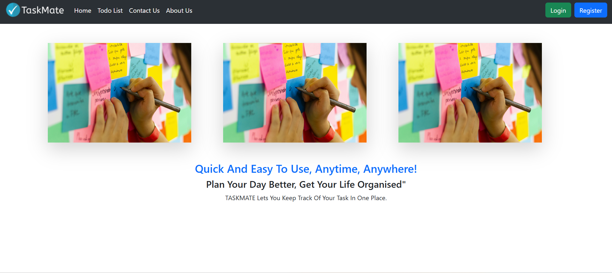
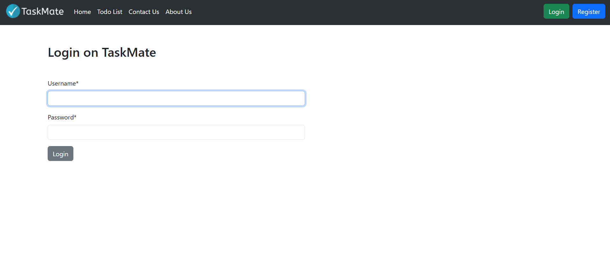
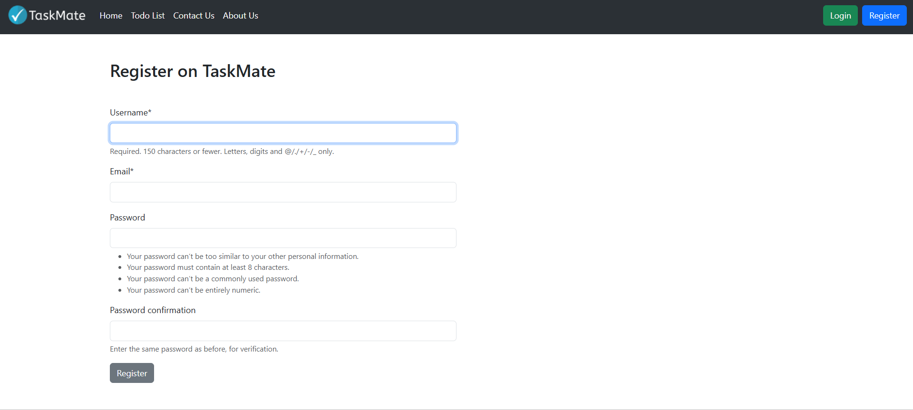
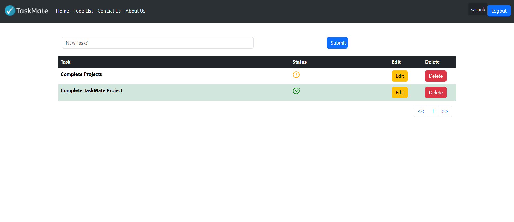

# Taskmate

Taskmate is a task manager web application built using the Django framework. This project aims to provide hands-on experience with Django and explore its core features. The development process involved implementing the Model-View-Template (MVT) architecture, working with Django forms, integrating standard authentication mechanisms, managing environment variables using .env files, and performing database operations with PostgreSQL.

Additionally, the project included learning how to deploy a Django application on the Railway platform, ensuring a smooth and scalable deployment process. Throughout this project, I gained valuable insights into user authentication, database migrations, form handling, session management, and best practices for deployment.

The application allows users to create, update, and manage tasks, providing a structured and user-friendly interface for efficiently organizing daily activities. The Taskmate project aims to gain hands-on experience with Django and explore its fundamental features. The development process involved implementing the Model-View-Template (MVT) architecture, working with Django forms, integrating default authentication mechanisms, managing environment variables using .env files, and handling database operations with PostgreSQL.
Additionally, the project included learning how to deploy a Django application on the Railway platform, ensuring a smooth and scalable deployment process. This project gave me valuable insights into user authentication, database migrations, form handling, session management, and deployment best practices.
The application enables users to create, update, and manage tasks, offering a structured and user-friendly interface for organizing daily activities efficiently.

## Screenshots

## Demo

Deployed on Railway - https://tm.up.railway.app/

Username: demo  
Password: Frustratedsniper@1994

  
## Documentation

[Official Django Documentation](https://www.djangoproject.com/)
